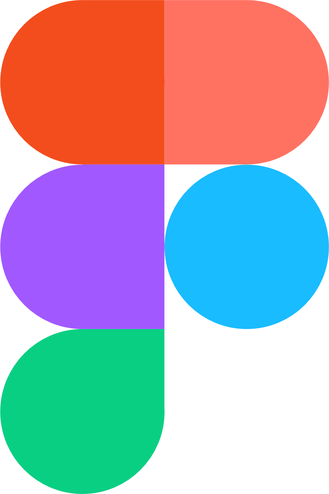
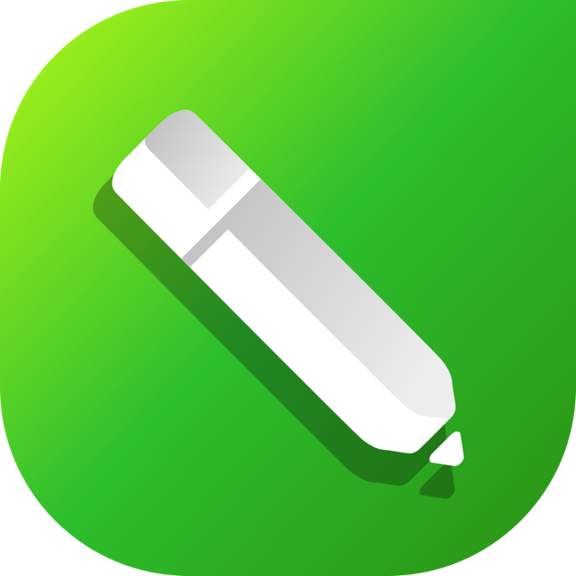

  

## 👨‍💻 Sobre mim:
Meu nome é Ricardo, moro em Sorocaba São Paulo, sou Desenvolvedor Front-End e atualmente estou fazendo minha transição de carreira e me especializando para conseguir minha primeira oportunidade como Desenvolvedor Front-End Jr. 
 
Como Desenvolvedor Front-End, estou focado em construir experiências digitais excepcionais e interfaces intuitivas, estou cursando formação full-stack na instituição de ensino Devclub onde estou buscando conhecimento a partir de projetos práticos para me formar em um futuro Desenvolvedor Full-Stack.
 

## 🤖 Linguagens e Tecnologias:
 

  
  
  
  
      

 
 

## 🎨 Ferramentas de Design:
 

    
    

 

## 💻 Estou buscando conhecimento em:
 

    
    
    

 

## 📱 Contatos:
 
  - 
  - 
  - 
  - 
 
  

## GitHub Stats
 

 

## GitHub Contribution Snake
 
<picture>
  <source media="(prefers-color-scheme: dark)" srcset="https://raw.githubusercontent.com/ricardoraphaeltech/ricardoraphaeltech/output/github-contribution-grid-snake-dark.svg">
  <source media="(prefers-color-scheme: light)" srcset="https://raw.githubusercontent.com/ricardoraphaeltech/ricardoraphaeltech/output/github-contribution-grid-snake.svg">
  
</picture>
